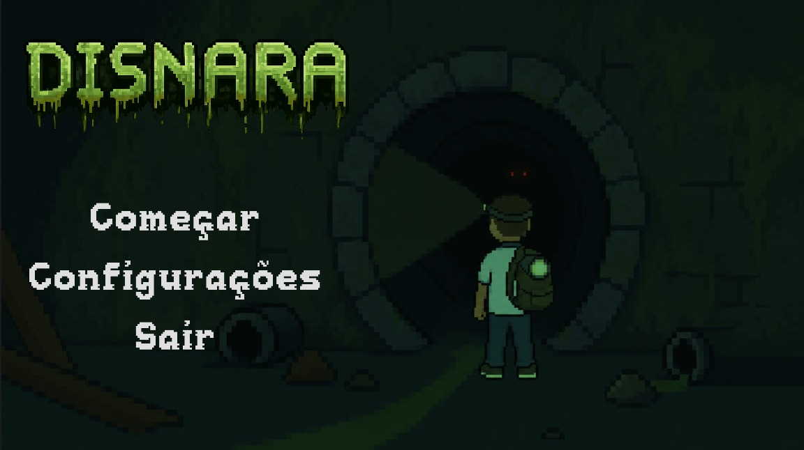
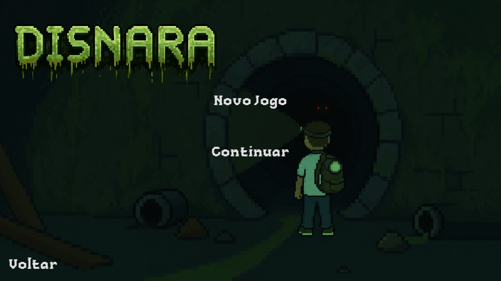
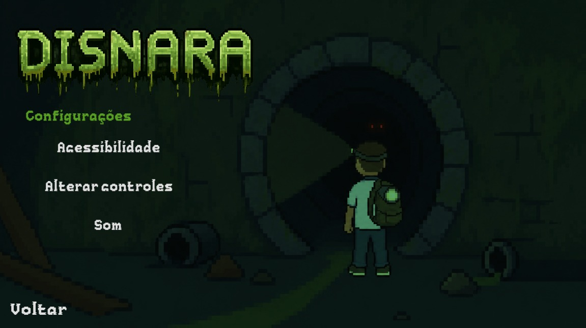
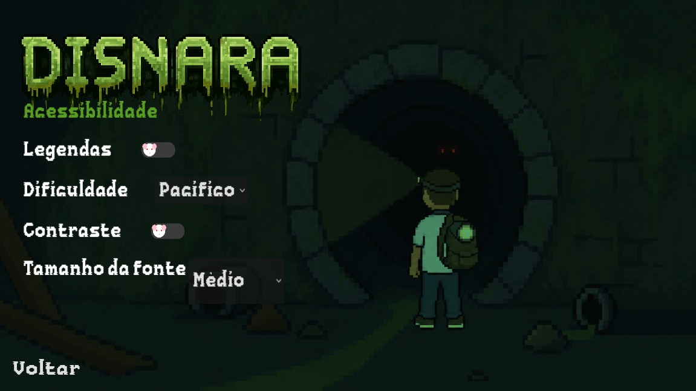
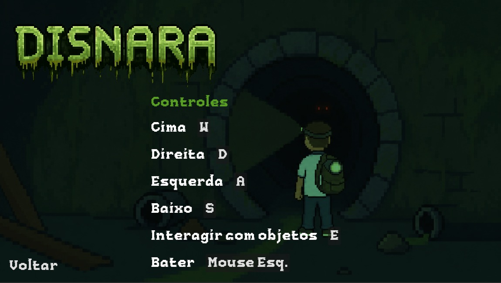
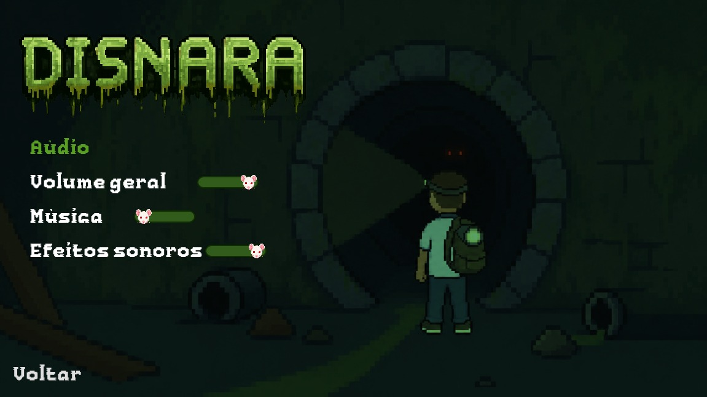

# 2026-303-Disnera
Trabalho de Tópicos Especiais em POO do Colégio Técnico para a criação de um jogo, apelidado de Disnera. 🐀

## Membros do grupo
- Arthur Emanuel 
- Maria Eduarda
- Paulo Henrique
- Pedro Silva
- Tiago Alves

## Sobre o jogo
Nosso jogo será desenvolvido no Godot. Assim, nossa ideia é de o jogo se passe nos esgotos do COLTEC, no ano de 2024, onde 4 amigos adentraram no esgoto em busca de uma lenda chamada Disnera, um rato albino gigante que mata pessoas - pelo menos é isso o que as lendas dizem. Porém, os garotos nunca mais foram vistos. A polícia foi chamada, mas a UFMG e o COLTEC, com medo de terem sua imagem manchada, abafaram o caso, fazendo com que ele virasse apenas mais uma lenda falada dentro dos corredores do colégio. Entretando, em 2026, a mesma história se reascende com novos amigos que desejavam passar por uma aventura e descobrir a verdade por trás de toda a lenda.

## Especificações Gerais 
- *Gênero:* Ação/Dungeon.
- *Interface:* Top-Down (Perspectiva do jogador) - 
 Corações para representar a vida do jogagor, botão de menu para pausar, sair ou mudar as configurações do jogo, mapa mostrando as salas exploradas (GUI).
- *Progressão da história:* Narrativa e relacional.
- *Personagens e NPCs:* Jogador, Reppo (NPC de ajuda), Disnera (Boss), Baratas (inimigo), Ratos (inimigo), Escorpiões (inimigo), Morcego (inimigo).
- *Cenários:* COLTEC e Esgoto.
- *Público Alvo:* Jovens.
- *Plataforma:* PC.

## Telas
- *Tela inicial:* Escolher se deseja começar a jogar, alterar alguma configuração ou sair do jogo.
- *Tela começar jogo:* Escolher se deseja iniciar um novo save ou continuar o mesmo save.
- *Tela de configurações:* Escolher para qual tela de configuração quer ir ou se quer voltar à tela anterior.
- *Tela de acessibilidades:* Alterar as acessibilidades do jogo.
- *Tela de controles:* Alterar os controles do jogo.
- *Tela de audio*: Aumentar ou diminuir os sons do jogo.

<h3 align="center">Tela inicial</h3>
 
 
- *Começar:* Iniciar o jogo. 
- *Configurações:* Ir para tela de configurações para o jogador alterar o que desejar.
- *Sair:* Fechar o jogo.

<h3 align="center">Tela começar jogo</h3>

- *Novo jogo:* Iniciar o jogo do zero com um novo save.
- *Continuar:* Continuar jogando da onde parou no último save criado.
- *Voltar:* Voltar à tela anterior.

<h3 align="center">Tela de configurações</h3>

- *Acessibilidade:* Ir à tela de acessibilidades.
- *Controles:* Ir à tela dos controles do jogo.
- *Som:* Ir à tela de sons do jogo.
- *Voltar:* Voltar à tela anterior.

<h3 align="center">Tela de acessibilidades</h3>
 

- *Legenda:* Ativar ou desativar legendas nos diálogos do protagonista ou dos NPCs, ideal para pessoas que sofrem de deficiência auditiva.
- *Dificuldade:* O jogador tem a opção de escolher a dificuldade que quer jogar.
- *Contraste:* Alterar cores do jogo, ideal para pessoas que possuem deficiência ocular.
- *Tamanho da fonte:* Alterar o tamanho da fonte das palavras, altera as palavras das telas e dos diálogos durante o jogo.
- *Voltar:* Voltar à tela anterior.

<h3 align="center">Tela de controles</h3>

- *Controles:* Controles pré-definidos no jogo, podendo ser alterados para qualquer tecla ou botão do mouse que o jogador desejar.
- *Voltar:* Voltar à tela anterior.

<h3 align="center">Tela de áudio</h3>

- *Volume geral:* Aumentar ou dimimuir o som de tudo no jogo.
- *Música:* Aumentar ou dimunuir o volume da música que toca ao fundo.
- *Efeitos sonoros:* Aumentar ou diminuir o som dos efeitos do jogo
- *Voltar:* Voltar à tela anterior.

## Conclusão

O projeto do jogo Disnera é uma iniciativa pequena, mas ambiciosa, para criar uma experiência imersiva e narrativa dentro de um ambiente inspirado no próprio COLTEC, misturando elementos de ação, exploração e suspense. Além de desenvolver um jogo com mecânicas e interfaces funcionais, o grupo pretende construir uma atmosfera envolvente, utilizando a lenda criada dentro do jogo, em torno da criatura Disnera, como o elemento principal da narrativa. Dessa forma, o trabalho também contribui para o aprendizado prático de conceitos de programação orientada a objetos, desenvolvimento de interfaces e organização de projetos em equipe, unindo criatividade e desenvolvimento técnico em um único projeto que promete ser divertido, intuitivo e desafiador.